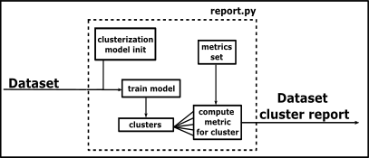

# Shluková analýza atributů datové sady

## Spuštění

-  instalace závislostí
    
        pip install -r requirements.txt 

-  spuštění skriptu na ukázkových datech
    
        python report.py sample_data.csv  

## Princip

- implementace skriptu, který shlukuje data na základě jejich atributů

- shlukování probíhá pomocí ML techniky (k-means)

- počet shluků je určen dynamicky iterativním způsobem (max. 10 shluků)

- každému shluku připadá jeden automaticky vygenerovaný report popisující data (atributy)

- report je tvořen obecně (rozptyl, průměr, korelace → možnost rozšíření), aby se dal aplikovat na kterákoliv vstupní data

    

## Myšlenky využití a možné problémy

- doplnění méně početných clusterů, generovat data splńující charakteristiku clusteru

- vyhodnocení clusteru klasifikátorem, určení úspěšnosti klasifikátoru na určité skupině dat

- generovat data, na kterých klasifikátor pohořel a následně ho přetrénovat

- rozšíření datové sady zachytáváním dat ze sítě a shromažďovat jen data, která spadají do požadovaného clusteru

- problém se složitostí generování dat na základě atributů v určitých mezích, ověření vhodnosti dat po opětovné clusterizaci

## Demonstrace na úkazkových datech

### Textový výstup - obecná charakteristika dvou vybraných clusterů

    cluster0

    Variance of features:
    Digits        0.000001
    Alexa         0.000397
    Consonant     0.001137
    Entropy       0.002758
    Dictionary    0.007288

    Average of features:
    Digits        0.002495
    Alexa         0.196644
    Dictionary    0.496656
    Consonant     0.500067
    Entropy       2.099427

    Average deviation of features (%):
    Digits       -95.085843
    Entropy      -86.857171
    Consonant    -81.348436
    Alexa         54.072657
    Dictionary    79.044237

    Correlation of features:
    Alexa       Consonant    -0.700682
    Consonant   Dictionary   -0.688794
    Dictionary  Entropy      -0.378350
    Alexa       Entropy      -0.372028
    Consonant   Digits       -0.120965
    Alexa       Digits       -0.087525
    Digits      Entropy      -0.083030
    Dictionary  Digits        0.010728
    Consonant   Entropy       0.863500
    Alexa       Dictionary    0.916959

    Size of cluster:
    179 

    cluster1

    Variance of features:
    Alexa         0.000223
    Consonant     0.000805
    Entropy       0.000850
    Digits        0.001014
    Dictionary    0.001071

    Average of features:
    Alexa         0.044916
    Dictionary    0.098282
    Digits        0.157254
    Consonant     0.711611
    Entropy       2.438414

    Average deviation of features (%):
    Alexa         -83.796088
    Dictionary    -79.536335
    Consonant       8.698795
    Entropy        11.540520
    Digits        209.683262

    Correlation of features:
    Alexa       Digits       -0.690761
    Dictionary  Digits       -0.676121
    Consonant   Digits       -0.409719
                Dictionary   -0.195893
    Alexa       Consonant    -0.163992
    Dictionary  Entropy      -0.133834
    Alexa       Entropy      -0.112475
    Digits      Entropy       0.013152
    Consonant   Entropy       0.139635
    Alexa       Dictionary    0.933043

    Size of cluster:
    897 

### Vizualizace průměrné odchylky atributu mezi konkrétním clusterem a původními daty

- Například cluster 4 vykazuje nadprůměrné zastoupení číslic

